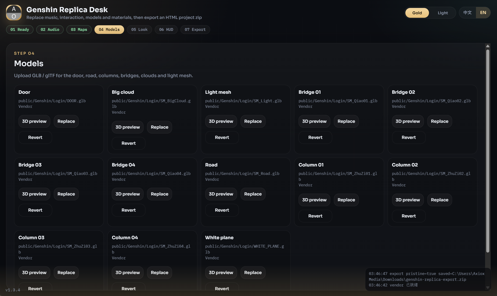

# 原神复刻编辑台

**Packed via Axiox Media**

本地步骤向导：改写 alphardex/genshin-replica 中的音乐、贴图、模型与材质参数，并导出可运行的 HTML 工程 zip。

  

  

> [!NOTE]
> Windows EXE 未签名，首次启动可能被 SmartScreen 拦截。

## 安装

### 1. GitHub 部署台（推荐）

使用 [GitHub Deploy Desk](https://github.com/axioxmedia/github-deployer) 一键部署本仓库。

### 2. 源码或 EXE

双击 `build_exe.bat`，或 `python app.py`。

## 功能

- 音频 / 贴图 / GLB 全部可替换
- 雾、灯光、天空渐变、相机可调
- 导出页可勾选左上角毛玻璃：系统时间、地区、天气（默认全关）
- 永久移除右侧书本按钮（ClickMe.png，无效功能）
- 未编辑直接导出时，保留原项目左下角免责声明

导出包为 Vite 工程，解压后执行 `npm i` 与 `npm run dev`。

Packed via Axiox Media · [axiox.media](https://axiox.media)
